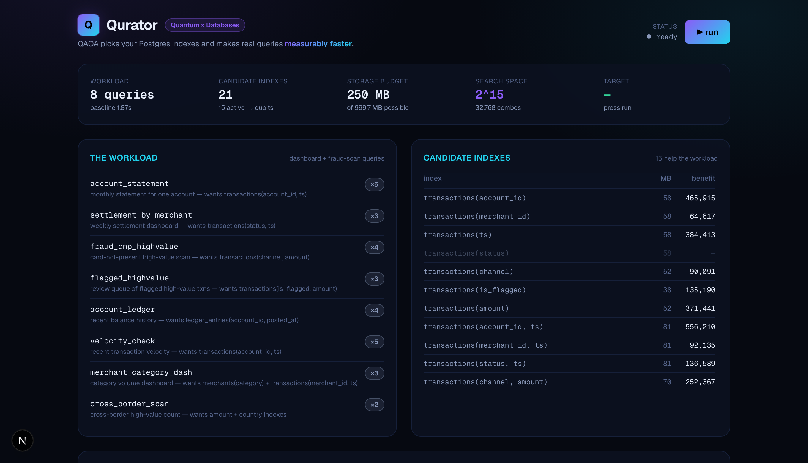
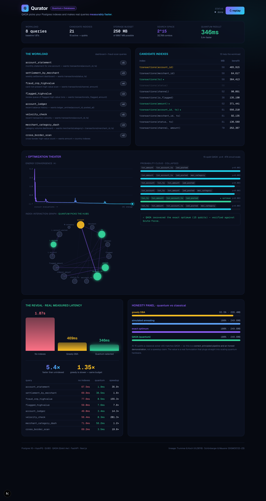

<div align="center">

# ⚛ Qurator

### Quantum optimization that picks your database indexes — and makes real queries measurably faster.

**QuantumHacks submission · Quantum × Databases × Fintech**

_QAOA chooses the optimal set of Postgres indexes under a storage budget, applies them to a live database,
and shows the query latency drop happen — on screen, on real data._



</div>

---

## The problem

Every serious database has an **index-tuning problem**, and it is expensive. Given a query workload and a fixed
storage budget, a DBA must choose **which** indexes to build. With just 20 candidate indexes there are over a
million combinations, the indexes **interact** (a composite index can dominate two single-column ones), and the
choice is **NP-hard** — a budgeted *weighted maximum-coverage* problem. Real tuning advisors fall back on greedy
heuristics that provably leave performance on the table.

## What Qurator does — the closed loop

```
workload + candidate indexes
   → HypoPG Cost Probe        measure each index's real what-if benefit, without building anything
   → QUBO                     encode "pick indexes under a budget" as a quadratic binary optimization
   → QAOA (Qiskit)            solve it on a quantum circuit; recover the optimal set
   → CREATE INDEX (for real)  apply the quantum-chosen set to the live database
   → measure                  re-run the workload and watch latency drop
```

The payoff is a **real, measured, non-fakeable system effect** — not a chart. On the demo instance:

| | weighted latency | vs quantum |
|---|---|---|
| **No indexes** | 1.87 s | — |
| Greedy DBA heuristic | 469 ms | 1.35× slower (same budget) |
| **Quantum-selected (QAOA)** | **346 ms** | **5.4× faster than unindexed** |

Individual queries go from **78 ms → 0.5 ms** (155×) and **56 ms → 0.3 ms** (201×). The greedy heuristic wastes
budget on a redundant single-column index (`transactions(account_id)`); QAOA finds the composite
`transactions(account_id, ts)` that serves two queries at once.



## Honesty (this is a feature, not a footnote)

At ~15 qubits a classical solver still **matches** QAOA — so Qurator is a **correct, principled pipeline and an
honest demonstration**, not a quantum-speedup claim. We benchmark QAOA against the **exact brute-force optimum**
on screen to prove it found the true answer, and the QUBO formulation plugs straight into scaling quantum
hardware (D-Wave / larger QPUs) where the advantage materializes. Grounded in real research:
**Trummer & Koch (VLDB 2016)** and **Schönberger & Mauerer (SIGMOD 2022–23)**.

---

## Quickstart

**Requirements:** Docker, Python 3.12, Node 20+, [`uv`](https://github.com/astral-sh/uv).

```bash
# 1. Database — Postgres 16 + HypoPG (host port 5433)
make db

# 2. Backend — venv, deps, seed 2M-row fintech dataset, generate the demo artifact
make setup
make seed
make cache          # runs the full probe → QAOA → apply → measure pipeline (~90s) and caches it

# 3. Run it
make api            # FastAPI on http://localhost:8088   (terminal 1)
make dev            # Next.js on http://localhost:3000    (terminal 2)
```

Open the frontend and press **▶ run** to play the optimization theater.

**Everything in Docker instead:** `make up` (db + backend). **Backend-free demo:** the frontend bundles a
snapshot (`public/demo_run.json`), so with `NEXT_PUBLIC_STATIC_ONLY=1` it renders the full experience with no
server — ideal for a Vercel deploy.

### CLI

```bash
make probe      # candidate index benefits (HypoPG what-if)
make solve      # greedy vs exact vs simulated annealing
make bench      # apply index sets for real and measure latency
make quantum    # full quantum pipeline (probe → QUBO → QAOA)
make test       # 69 backend tests
make reset      # drop all qur_* indexes, restore clean baseline
```

---

## How it works

**1. Cost Probe (`qurator/costprobe.py`).** For each candidate index we register it as a *hypothetical* index
with **HypoPG** and re-`EXPLAIN` every query — measuring the estimated cost reduction without building anything.
~21 candidates × 8 queries is a few hundred cheap `EXPLAIN`s.

**2. QUBO (`qurator/qubo.py`).** The workload benefit `Σ_q wᵩ · max_{i∈S} bᵩᵢ` (Postgres uses the single best
index per scan) is linearized into a quadratic form; the storage budget becomes an **unbalanced-penalty** term
that needs **no slack qubits**. Benefits are normalized so the landscape is well-conditioned.

**3. QAOA (`qurator/solvers/qaoa.py`).** The QUBO → Ising cost Hamiltonian → `QAOAAnsatz` (Qiskit). We optimize
`⟨H⟩` with **layerwise INTERP growth** (p:1→4) so the circuit reliably concentrates probability, simulate exactly
with `Statevector`, then decode the best **feasible** bitstring by the true objective. On the 15-qubit demo it
recovers the exact optimum, verified against brute force.

**4. Apply & measure (`qurator/apply.py`).** Real `CREATE INDEX` on the live DB, warm the cache, and measure
median wall-clock latency — the before/after reveal.

**5. Theater (`frontend/`).** A Next.js dashboard streams the energy convergence, the probability cloud
collapsing onto the winning index set, the index-interaction graph, and the real latency drop.

## Project layout

```
db/          Postgres 16 + HypoPG image, schema
backend/     Python package `qurator`
  costprobe · qubo · model · solvers/{classical,qaoa,qubo_solver} · apply · pipeline · api · cli
  tests/     69 tests (classical optimum vs brute force, QUBO correctness, QAOA recovers optimum)
frontend/    Next.js 16 + React 19 + Tailwind — the optimization theater
```

## Tech stack

PostgreSQL 16 · HypoPG · Python · Qiskit + Qiskit Aer · NumPy/SciPy · FastAPI · Next.js 16 · React 19 · Tailwind CSS.

---

<div align="center">
Built for <b>QuantumHacks</b> — <i>The Future Is Yours to Build.</i>
</div>
